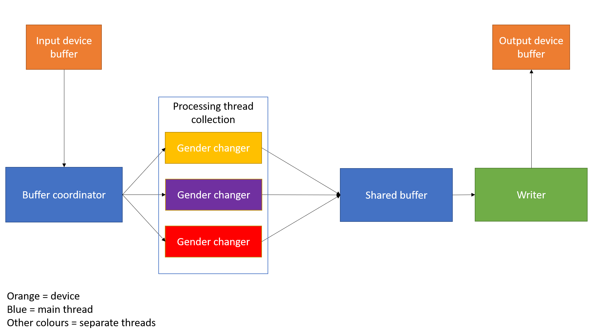

# Voice Gender Changer

The goal of this software is to change the gender of the voice of the user, enough to cover for the hardest parts of voice training.

## Design

Below is the block diagram showing how the program works

1. Buffer coordinator in main thread reads from the input device buffer, and puts the data into an available gender changer thread. If no existing thread is available, a new one is created. Unneeded threads are destroyed until there are a minimum of 3 remaining. Each thread is spawned with the timestamp it was received at.
2. Gender changer threads change the gender of their audio, and then put it into the shared buffer, which is sorted by timestamp
3. Writer thread checks the first element of the shared buffer. If the first element is within a certain time delay from the current time, it pops it and writes it to the output device buffer, then repeats. If the first element is less than the time delay, it ignores it and breaks. If the first element is greater than the time delay, it discards the packet and repeats.
